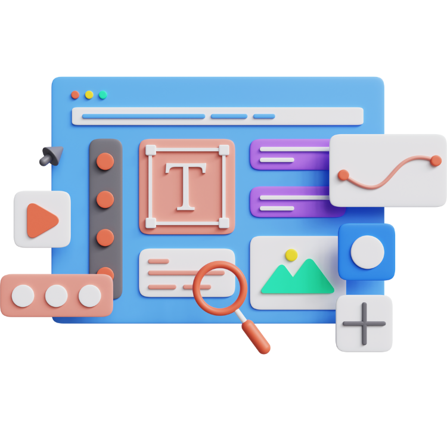

<a name="readme-top"></a>

<div align="center">
  
  <br/><br/>

  <h1><b> Front-end React Redux </b></h1>

  <br/>

</div>

# 📗 Table of Contents

- [📖 About the Project](#about-project)
  - [🛠 Built With](#built-with)
    - [Tech Stack](#tech-stack)
    - [Key Features](#key-features)
  - [🚀 Live Demo](#live-demo)
- [💻 Getting Started](#getting-started)
  - [Setup](#setup)
  - [Prerequisites](#prerequisites)
  - [Install](#install)
  - [Usage](#usage)
  - [Run tests](#run-tests)
  - [Deployment](#triangular_flag_on_post-deployment)
- [👥 Authors](#authors)
- [🔭 Future Features](#future-features)
- [🤝 Contributing](#contributing)
- [⭐️ Show your support](#support)
- [🔭 Acknowledgements](#acknowledgements)
- [❓ FAQ](#faq)
- [📝 License](#license)


This application allows you to:

- See a random greeting

## 🛠 Built With <a name="built-with"></a>

### Tech Stack <a name="tech-stack"></a>

<details>
  <summary>Technology</summary>
  <ul>
    <li>Ruby</li>
    <li>Rails</li>
    <li>PostgresSQL</li>
  </ul>
</details>

<details>
  <summary>Tools</summary>
  <ul>
    <li>VS Code</li>
    <li>GIT</li>
    <li>GITHUB</li>
  </ul>
</details>

<br>

🛠 Frontend repository:
To visit the backend repository, [Please Click Here](https://github.com/PierreBarba/ruby-on-rails-backEnd.git).

<br>

<!-- Features -->

### Key Features <a name="key-features"></a>

- Use Postgres database.
- Use React to fetch the API
- Use WebPack to pack the JavaScript code

<p align="right">(<a href="#readme-top">back to top</a>)</p>

<!-- LIVE DEMO -->

## 🚀 Live Demo <a name="live-demo"></a>

- Sorry, Currently not available

<p align="right">(<a href="#readme-top">back to top</a>)</p>

<!-- GETTING STARTED -->

## 💻 Getting Started <a name="getting-started"></a>

To get a local copy up and running follow these simple example steps.

### Prerequisites

you have to those tools in your local machine.

- [ ] React
- [ ] React Router Dom
- [ ] Redux
- [ ] GIT & GITHUB
- [ ] Any Code Editor (VS Code, Brackets, etc)

### Clone Repo

Clone the project using the following bash command in an appropriate location.

```bash
  git clone https://github.com/PierreBarba/react-redux-frontend.git
```

Go to the project directory.

```bash
    cd react-redux-frontend
```

### Getting Started with Create React App and Redux
This project was bootstrapped with [Create React App](https://github.com/facebook/create-react-app), using the [Redux](https://redux.js.org/) and [Redux Toolkit](https://redux-toolkit.js.org/) template.
#### Available Scripts
In the project directory, you can run:
```bash
  npm start
```
Runs the app in the development mode.\
Open [http://localhost:3000](http://localhost:3000) to view it in your browser.
The page will reload when you make changes.\
You may also see any lint errors in the console.
```bash
  npm test
```
Launches the test runner in the interactive watch mode.\
See the section about [running tests](https://facebook.github.io/create-react-app/docs/running-tests) for more information.
```bash
  npm run build
```
Builds the app for production to the `build` folder.\
It correctly bundles React in production mode and optimizes the build for the best performance.
The build is minified and the filenames include the hashes.\
Your app is ready to be deployed!
See the section about [deployment](https://facebook.github.io/create-react-app/docs/deployment) for more information.
```bash
  npm run eject
```
### Learn More
You can learn more in the [Create React App documentation](https://facebook.github.io/create-react-app/docs/getting-started).
To learn React, check out the [React documentation](https://reactjs.org/).

<!-- AUTHORS -->

## 👥 Authors <a name="authors"></a>


**Jean Pierre Barba**

[](https://github.com/PierreBarba) [](https://www.linkedin.com/in/jean-pierre-barba/)

<p align="right">(<a href="#readme-top">back to top</a>)</p>

## 🔭 Future Features <a name="future-features"></a>

- [ ] **Live demo will added soon**

<p align="right">(<a href="#readme-top">back to top</a>)</p>

<!-- CONTRIBUTING -->

## 🤝 Contributing <a name="contributing"></a>

Contributions, issues, and feature requests are welcome!

Feel free to check the [issues page](https://github.com/PierreBarba/Ruby-on-Rails-React/issues).

<p align="right">(<a href="#readme-top">back to top</a>)</p>

<!-- SUPPORT -->

## 👋 Show your support <a name="support"></a>

Give a ⭐️ if you like this project!

<p align="right">(<a href="#readme-top">back to top</a>)</p>

<!-- ACKNOWLEDGEMENTS -->

## 🔭Acknowledgments <a name="acknowledgements"></a>

- My Family.
- [Microverse](microverse.org)

<p align="right">(<a href="#readme-top">back to top</a>)</p>

<!-- FAQ (optional) -->

## ❓ FAQ <a name="faq"></a>

- **Can I use this project for personal use?**

  - Yes, you can use it.

<p align="right">(<a href="#readme-top">back to top</a>)</p>

## 📝 License <a name="license"></a>

This project is [MIT](./LICENSE) licensed.